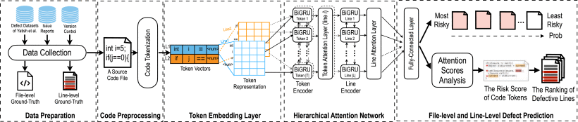

## Vocabulary

### Hyper parameters used to train a DeepLineDP model:
* batch_size = 8
* num_epochs = 10
* embed_dim (word embedding size) = 50
* word_gru_hidden_dim = 64
* sent_gru_hidden_dim = 64
* word_gru_num_layers = 1
* sent_gru_num_layers = 1
* dropout = 0.2
* lr (learning rate) = 0.001

### Meaning of hyper parameters and other model settings:
* vocab_size: number of words in the vocabulary of the model
* embed_dim: dimension of word embeddings
* word_gru_hidden_dim: dimension of word-level GRU; biGRU output is double this size
* sent_gru_hidden_dim: dimension of sentence-level GRU; biGRU output is double this size
* word_gru_num_layers: number of layers in word-level GRU
* sent_gru_num_layers: number of layers in sentence-level GRU
* word_att_dim: dimension of word-level attention layer
* sent_att_dim: dimension of sentence-level attention layer
* use_layer_norm: whether to use layer normalization
* dropout: dropout rate; 0 to not use dropout

## Explanation
### Project steps

1. Generate a vector representation for each code token.
2. Employ a bidirectional GRU unit to capture the surrounding tokens of that source code line.
3. Employ a Hierarchical Attention Network (HAN) architecture to learn the hierarchical structure of source code to predict defective files.
4. Compute the risk score of code tokens that contribute to the prediction of a given defective file using the attention mechanism.
5. Generate a ranking of risky lines using the summation of the risk score of the code tokens that appear in that line.

### Steps in detail
1. Our approach begins with data collection and data preparation to generate datasets that contains source code files, file-level and line-level ground-truth labels (i.e., files that are affected by a post-release defect and lines that changed or deleted to address the defect). For each source code file, we perform several preproceessing steps, including code abstraction and vocabulary size management. The structure: 
   * files -> code file -> line -> sequence of code tokens -> languague syntax words ~ code token - `if (j == 0) System.out.println('...')`

2. Perform source code representation to generate a vector representation.
3. Use a hierarchical attention network to learn the hierarchical structure of source code for file-level defect prediction, while enabling line-level defect prediction.

   * **Token Encoder.**\
   Given a line li with a sequence of tokens T and a word embedding matrix W∈R|VC|×d, where VC is the vocabulary containing all tokens extracted from training source code files and d is the word embedding size of the representation of tokens, we first obtain a vector representation of each token for each line vit=W(wit) from Word2Vec, where vit indicates the vector representation of token wit in the word embedding matrix W. **Word2Vec is used to express lines of code as vectors.** 

   * **Token Attention.**\
   Based on the intuition that not all tokens contribute equally to the semantic representation of the source code line, we use the attention mechanism [67] to highlight the tokens that are more important to the semantics of the source code lines and aggregate the representation of those informative tokens to form a line vector.

   * **Line Encoder.**\
   Given source code lines (i.e., li), we use a bidirectional GRU to encode the lines.

   * **Line attention.**\
   We again use an attention mechanism to highlight the lines that are more important to the semantics of the source code files and aggregate the representation of those informative lines to form a file vector.

4. The prediction layer produces the probability score of the prediction of defective files:
   * The embedding vector ef is a high level representation of the source code file which can be used as features for file-level defect prediction.The prediction score is passed to an output layer to compute a probability score for a given source code file.\
   \
   To identify defective lines, we first extract the attention score, ranges from -1 to 1, of each code token in that defective file. The attention score, calculated by the attention mechanism, is used as a proxy to indicate the riskiness of code tokens. The concept of the attention score is similar to the importance score of the random forest’s variable importance that is widely-used in software engineering, but having different calculations. To do so, we rank the attention score obtained from the token attention layer in a descending order. Then, we select the top-k tokens that have the highest attention scores. Then, we compute the line-level risk score as the summation of the risk score of any tokens that appear in the top-k. Finally, we produce a ranking of the most risky lines based on the risk scores of each line. In this paper, we choose the k of 1,500.
   
5. Use the token-level attention layer to identify defective lines based on the most important tokens that contribute to the prediction of defective files.

### Technical stuff
We use the word embedding vector size d of 50 to train Word2Vec model. We use the learning rate of 0.001. The model is trained at 10 epochs. The batch size is set to 32. We use the binary cross-entropy as the loss function. We use the Adam optimizer to minimize the loss function, since it has been shown to be computationally efficient and require low memory consumption. We use Dropout (the dropout ratio is 0.5) and Layer Normalization to prevent overfitting. The reason for this is that Watson et al. found that the Dropout is one of the most commonly-used techniques to prevent overfitting and underfitting in software engineering tasks.

#### Evaluation Measures.
We use traditional measures (i.e., AUC, Balanced Accuracy, MCC) for evaluating file-level defect prediction and effort-aware measures (i.e., Recall@Top20%LOC, Effort@Top20%Recall, Initial False Alarms) for evaluating line-level defect prediction.

AUC is an area under the ROC Curve (i.e., the true positive rate and the false positive rate). AUC values range from 0 to 1, with a value of 1 indicates perfect discrimination, while a value of 0.5 indicates random guessing.

Recall@Top20%LOC measures how many defective lines that can be accurately found when inspecting the top 20% LOC of the whole release. A high value of Recall@Top20%LOC indicates that our approach can rank many actual defective lines at the top and many actual defective lines can be found given a fixed amount of effort. On the other hand, a low value of Recall@Top20%LOC indicates that many clean lines are in the top-20% LOC and developers need to spend more effort to identify defective lines.

Effort@Top20%Recall measures how much effort (i.e., LOC) required to find the 20% actual defective lines of the whole release. A low value of Effort@Top20%Recall indicates that developers spend a small amount of effort to find the top-20% actual defective lines. On the other hand, a high value of Effort@Top20%Recall indicates that developers spend a large amount of effort to find the top-20% actual defective lines.

Initial False Alarm measures the number of clean lines that developers need to inspect until the first defective line is found for each file. A low IFA value indicates that few clean lines are ranked at the top, while a high IFA value indicates that developers will spend unnecessary effort on clean lines. The intuition behinds this measure is that developers may stop inspecting if they could not get promising results (i.e., find defective lines) within the first few inspected lines

### Comparison
We compare the ranking of risky lines with the three state-of-the-art line-level defect prediction approaches:

* ErrorProne is a static analysis tool that builds on top of a primary Java compiler (javac) to check errors in source code based on a set of error-prone rules. ErrorProne checks if a given source code file is matching error-prone rules using all type attribution and symbol information extracted by the compiler. The report of ErrorProne includes the matched error-prone rules, suggestion messages, and the corresponding lines in the file. In this experiment, we identify the corresponding lines reported by ErrorProne as defect-prone lines. Since ErrorProne does not provide priority of the reported errors like PMD, we rank the defect-prone lines based on the line number in the file. This mimics a topdown reading approach, i.e., developers sequentially read source code from the first to last lines of the files.
* N-gram is used to infer the unnaturalness of each code token based on the entropy score of each code token. We selected N-gram as our baseline, since prior studies showed that N-gram is effective in identifying defective lines (i.e., high entropy = unnaturalness of code tokens). We use an implementation of Hellendoorn and Devanbu to build cache-based language models, i.e., an enhanced n-gram model that is suitable for source code. The cache-based language models are built by learning from clean code files (i.e., the files that do not contain defective lines). Similar to prior work, once the entropy scores for all code tokens are calculated, the average of the entropy scores for each line is computed. Then, we rank the source code lines based on the average entropy values of tokens in each line.
* Random Forest (RF) is used to predict which lines in a defective file are clean or defective. The model used DeepLineDP’s initial token representation at line level as features to train the model.